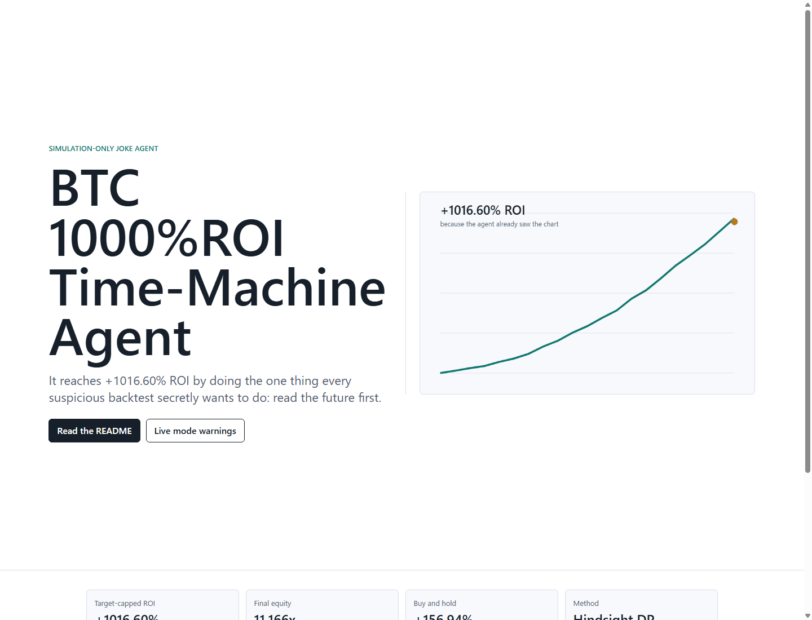

# BTC 1000%ROI Time-Machine Agent

> A joke trading agent that gets **+1000% ROI** by doing the most powerful thing in finance: already knowing the future.

This repo is intentionally honest about the cheat.

It takes historical BTC candles, looks at the whole past period, and then chooses whether it *should have been* long, short, or flat on each candle. That is how the 1000% ROI happens.

It is not alpha. It is not financial advice. It is a time machine with a CLI.



## The headline result

Backtest window:

- Symbol: `BTCUSDT`
- Source: Binance public klines
- Period: `2022-05-26` to `2026-05-26`
- Timeframe: `4h`
- Leverage: `1x`
- Fee model: `4 bps` per side
- Target-capped result: `+1016.60% ROI`
- Final equity: `11.166x`
- Buy and hold over the same window: `+156.94%`

The uncapped hindsight optimizer goes much, much higher. That number is less funny and more obviously cursed, so the default demo stops after crossing 1000% ROI.

Reproducibility note: the default command fetches Binance public klines at run time. The result above was reproduced on 2026-05-26, but public API availability, rate limits, delistings, or historical data revisions can change future reruns.

## How it works

The agent uses a dynamic-programming optimizer over the full return series:

1. Fetch BTC candles.
2. Compute close-to-close returns.
3. At every step, choose one of:
   - `LONG`
   - `SHORT`
   - `FLAT`
4. Penalize position changes with a fee.
5. Pick the path that maximizes final equity.
6. Stop the public demo once equity crosses `11x`.

In plain English:

> It wins because it is allowed to read the answer key.

## Install

```bash
npm install
```

## What works immediately after cloning

Anyone can clone this repo and run the joke backtest:

```bash
git clone https://github.com/kei99-web3/btc-1000-roi-time-machine-agent.git
cd btc-1000-roi-time-machine-agent
npm ci
npm run typecheck
npm test
npm run backtest
```

This works without a wallet, private key, API key, paid service, or Injective setup. The default backtest fetches public Binance BTCUSDT candles and reproduces the hindsight result when the same public data is available.

## What needs your own setup

These parts do not work out of the box because they require user-controlled external accounts or infrastructure:

- Injective testnet registration.
- Injective MCP server connection.
- Wallet creation, faucet funding, private-key handling, or agent registration.
- Any real or testnet order execution.

Live-order tooling is disabled by default. A user must intentionally configure Injective MCP, provide their own wallet setup, set the explicit acknowledgement environment variable, and pass the CLI risk flag before any live MCP tool call is allowed.

## Run the joke backtest

```bash
npm run backtest
```

Optional:

```bash
npm run backtest -- --start 2022-05-26 --end 2026-05-26 --interval 4h --target-multiple 11
```

## Open the visual demo

Public demo:

```text
https://raw.githack.com/kei99-web3/btc-1000-roi-time-machine-agent/main/index.html
```

Local demo:

```text
src/web/index.html
```

The demo explains the cheat and shows the 1000% ROI path as a time-machine artifact.

## Live trading mode

This repo includes an intentionally gated live-order bridge for people who want to wire the agent into Injective tooling.

Important:

- The hindsight strategy cannot predict the future.
- Live mode does not magically know the next candle.
- Live order execution is disabled by default.
- You must install and configure Injective MCP tooling yourself.
- You must set an explicit opt-in acknowledgement before any live tool call is allowed.

See [docs/LIVE_TRADING.md](docs/LIVE_TRADING.md).

## Injective Agent Card

The draft Agent Card lives in:

```text
agent-card/btc-1000-roi-time-machine-agent.card.json
```

The recommended first on-chain step is a testnet registration of a simulation-only joke agent identity, not a mainnet trading deployment.

Testnet identity:

- Agent ID: `26`
- Identity tuple: `eip155:1439:0x8004A818BFB912233c491871b3d84c89A494BD9e:26`
- Testnet registry contract: <https://testnet.blockscout.injective.network/address/0x8004A818BFB912233c491871b3d84c89A494BD9e>
- Register tx: <https://testnet.blockscout.injective.network/tx/0x9c4cc26e686999d5121dd05d20eb198e549221bf0b6460b3f509713c18a37614>
- Wallet-link tx: <https://testnet.blockscout.injective.network/tx/0xd154877614d31218b71be08af8c898c1567483a520618cef4e91d19bca6333bb>

Note: `8004scan.io` currently indexes the Injective mainnet registry (`chainId 1776`). This agent was intentionally registered on Injective EVM testnet (`chainId 1439`), so use the Blockscout links above for public testnet evidence.

See [docs/INJECTIVE_AGENT.md](docs/INJECTIVE_AGENT.md).

## Why this exists

Because backtests often look better than reality.

This project makes that joke explicit:

- It shows a spectacular chart.
- It explains exactly why the chart is cheating.
- It lets builders inspect the code.
- It turns overfitting into an on-chain agent identity gag.

## What this is not

This is not:

- A profitable trading strategy.
- A recommendation to buy or sell BTC.
- A claim that 1000% ROI is repeatable.
- A live trading bot you should run with money you care about.
- A hidden alpha leak.

## Star this repo if

- You have ever seen a backtest that looked too good.
- You believe every trading bot should disclose where the time machine is hidden.
- You want an on-chain joke agent with a dangerously honest README.

## License

MIT
